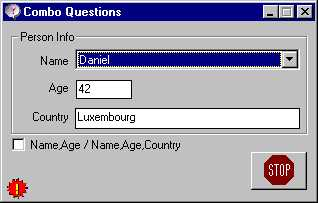



## Combo Box Tips

### Description

Combo Box Tips:

Often I'm getting different questions on COMBOBOX from colleagues & friends. And finally I decided to include some of the questions and make a sample so that I could share this sample as a reference program.

Most of the time questions are very simple but its normal, simple things are difficult to remember ;-)

1. How to Sort in the combo

2. Select only combo (like asp)

3. Putting data field behind the text displayed (like asp)

4. How to load default value

5. Sorted combo while inserting Item-Data

6. How to put string values as Item-Data

7. How to use more than 2 Item-Data

I have tried to include more common questions and there answer in this sample,I hope this sample could able to answer some of your question and you find is useful for your purpose.

Thanks for your feedback.
 
### More Info
 

             |
---                |---
**Submitted On**   |2003-07-01 15:21:42
**By**             |[Deepak Kumar Shaw](https://github.com/Planet-Source-Code/PSCIndex/blob/master/ByAuthor/deepak-kumar-shaw.md)
**Level**          |Intermediate
**User Rating**    |5.0 (10 globes from 2 users)
**Compatibility**  |VB 4\.0 \(16\-bit\), VB 4\.0 \(32\-bit\), VB 5\.0, VB 6\.0
**Category**       |[Custom Controls/ Forms/  Menus](https://github.com/Planet-Source-Code/PSCIndex/blob/master/ByCategory/custom-controls-forms-menus__1-4.md)
**World**          |[Visual Basic](https://github.com/Planet-Source-Code/PSCIndex/blob/master/ByWorld/visual-basic.md)
**Archive File**   |[Combo\_Box\_160819712003\.zip](https://github.com/Planet-Source-Code/deepak-kumar-shaw-combo-box-tips__1-46565/archive/master.zip)

